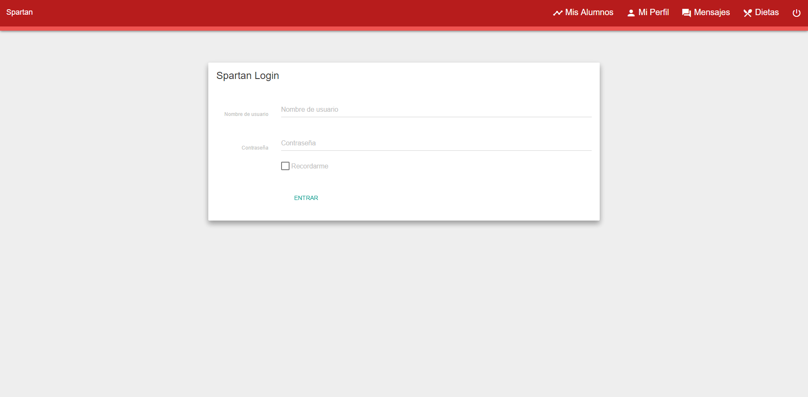
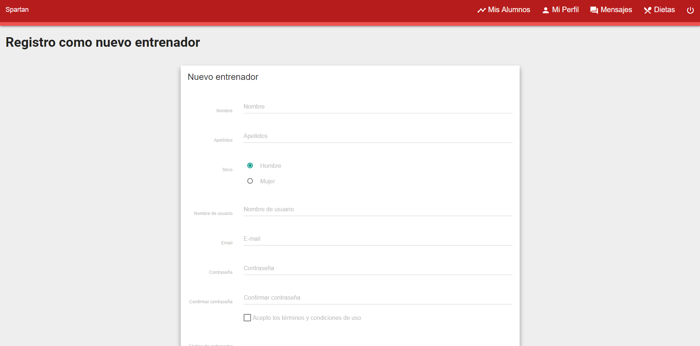
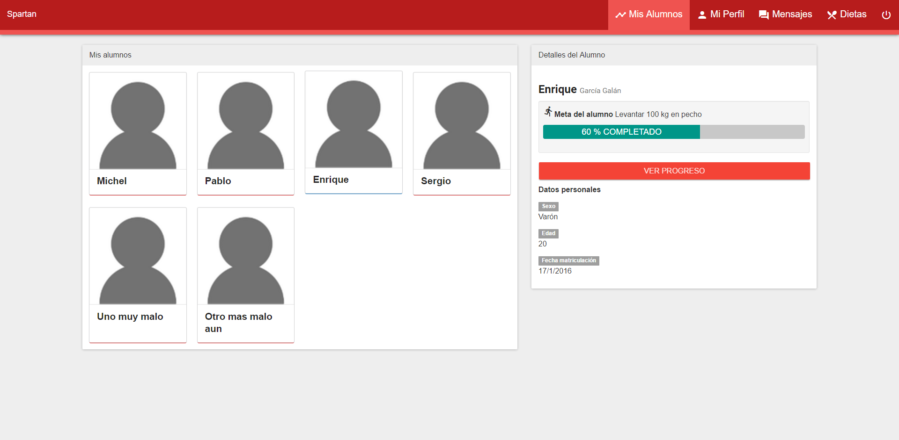
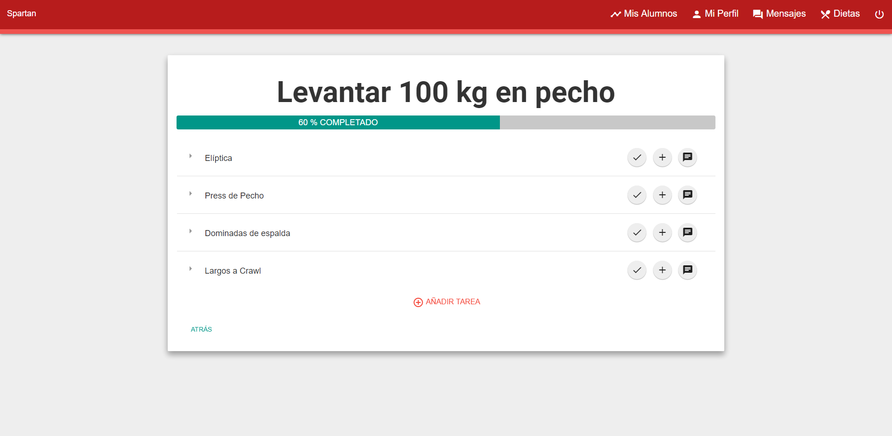
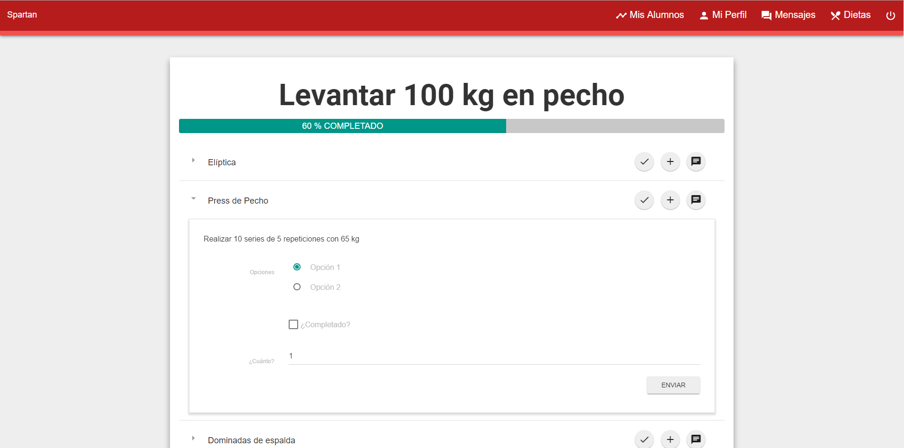
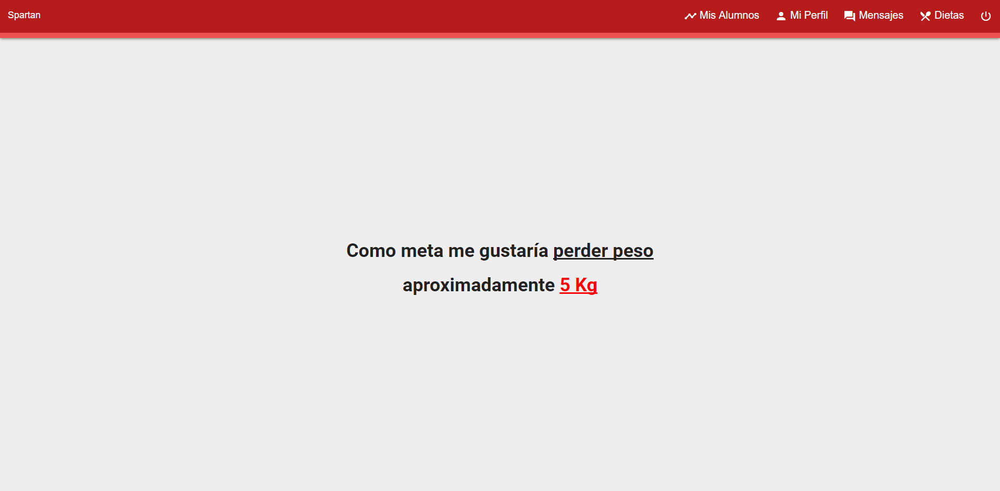
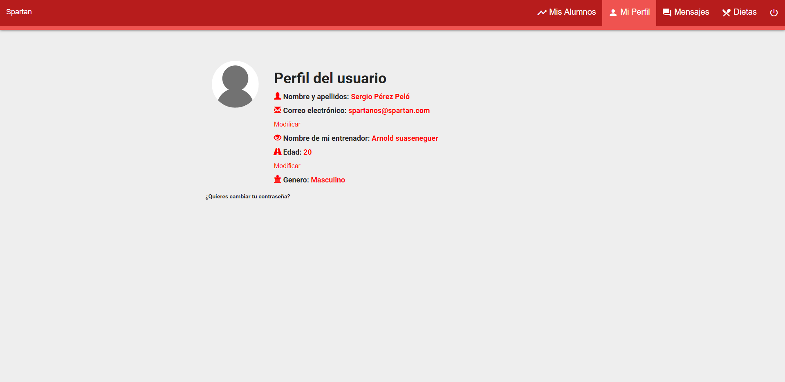
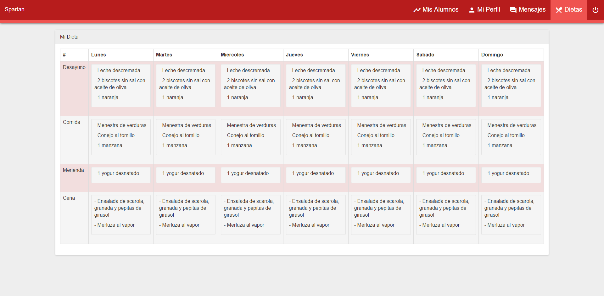

# Spartan

## Descripción de la temática de la web
Spartan es una aplicación web que te permitirá realizar un seguimiento de tú a tú con tu entrenador. Te permitirá llevar un control fácil, rápido, directo, actualizado y completo de toda tu actividad, con el objetivo de que mejores y alcances las metas que te marques tú o tu entrenador.

## Entidades

- Usuario (Entrenado/Entrenador)
- Metas (formadas por tareas)
- Tareas
- Dietas 

De forma adicional y de cara a la visibilidad se pueden sacar estadisticas de seguimiento a partir de las entidades

## Funcionamiento
La release se ejecuta con las especificaciones dadas en clase. Es necesario:
- node 4.2.X
- npm 3.6.X
- `npm install` para dependencias
- Lanzar el servidor con `ng serve` de angular cli

Para ejecutar la aplicacipn seguir los siguientes pasos:
- Clonar el repositorio `https://github.com/Maes95/Spartan.git` 
- Desplazarse hasta la carpeta Spartan recién clonada y ejecutar el comando "ng serve" (puede necesitarse permisos de administrador)
- Abrir en el navegador el puerto proporcionado por angular cli

Implementado en Angular2. Probada la funcionalidad en Windows, Mac y Linux.

## Diagrama de navegación

## Captura de pantalla de las páginas principales

<b>Login</b>

<b>Registro Alumno</b>

<b>Registro Entrenador</b>

<b>Mis Alumnos</b>

<b>Detalle Alumno 1</b>

<b>Detalle Alumno 2</b>

<b>Añadir Meta</b>

<b>Mi perfil</b>

<b>Dieta</b>

## Diagrama de clases Typescript utilizadas en Angular2

## Integrantes del equipo de desarrollo:

<!-- Tabla -->
<table cellspacing="0">
  <tr  style="background-color: #E3E3E3;">
    <td> <b>Nombre</b> </td>
    <td> <b>Apellidos</b> </td>
    <td> <b>GitHub</b> </td>
	  <td> <b>Correo URJC</b> </td>
  </tr>
  <tr style="background-color: #FFFFFF;">
    <td> Enrique </td>
    <td> García Galán </td>
    <td> <a href="https://github.com/ea2809">  ea2809 </a></td>
	  <td> <a href="mailto:e.garciagala@alumnos.urjc.es"> e.garciagala@alumnos.urjc.es</a></td>
  </tr>
    <td> Michel </td>
    <td> Maes Bermejo </td>
    <td> <a href="https://github.com/Maes95">  Maes95 </a></td>
	  <td> <a href="mailto:m.maes@alumnos.urjc.es"> m.maes@alumnos.urjc.es</a></td>
  </tr>
    <td> Pablo </td>
    <td> Fuente Pérez </td>
    <td> <a href="https://github.com/pabloFuente">  pabloFuente </a></td>
	  <td> <a href="mailto:p.fuente@alumnos.urjc.es"> p.fuente@alumnos.urjc.es</a></td>
  </tr>
    <td> Sergio </td>
    <td> Pérez Peló </td>
    <td> <a href="https://github.com/SackerTesla">  SackerTesla </a></td>
	  <td> <a href="mailto:s.perezpel@alumnos.urjc.es"> s.perezpel@alumnos.urjc.es</a></td>
  </tr>
</table>
<!-- Fin tabla -->
